# Mockoon

## Commands

```dos
npm init -y
npm i -D curl
npm i -D nodemon
npm i -D dotenv
npm i -D node-fetch
```

```dos
C:\Code\MyMock1\Mockoon\mockoon-simple>mockoon-cli
Mockoon's CLI. Deploy your mock APIs anywhere.

VERSION
  @mockoon/cli/1.3.0 win32-x64 node-v14.17.3

USAGE
  $ mockoon-cli [COMMAND]

COMMANDS
  dockerize  Create a Dockerfile to build a self-contained image of a mock API
  help       display help for mockoon-cli
  list       List running mock APIs
  start      Start a mock API
  stop       Stop a mock API
```

```dos
npm install -g @mockoon/cli
mockoon-cli [COMMAND]
mockoon-cli start --data data.json
mockoon-cli start --data https://domain.com/data.json
mockoon-cli list
```

Docker!

```dos
mockoon-cli dockerize --data ./data.json --port 3000 --index 0 --output ./tmp/Dockerfile
docker build -t mockoon-test .
docker run -d -p <host_port>:3000 mockoon-mock1
```

## Install Mockoon

Download mockoon.setup.1.17.0.exe

Copy/move it to C:\Apps\Mockoon\ folder

## Run Mockoon

### Launch mockoon.setup.x.x.x.exe

mockoon.setup.1.17.0.exe

### Settings

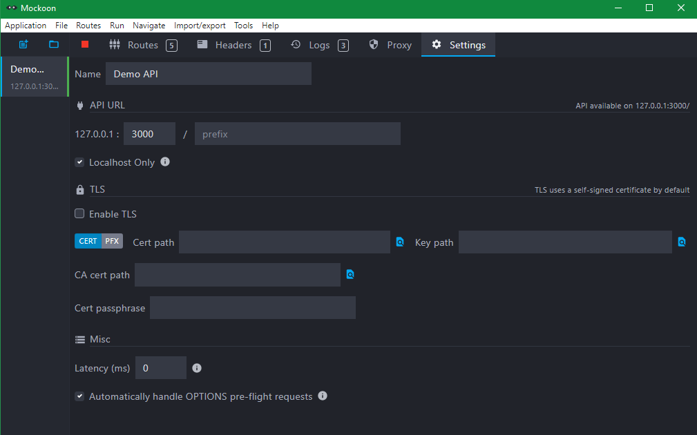

### Start

Click the green triangle button to start it

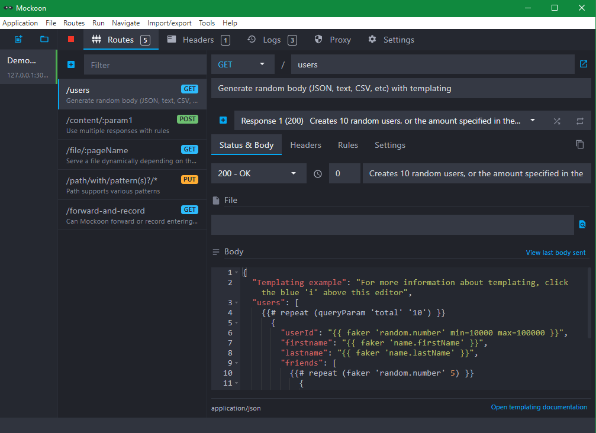

### Use

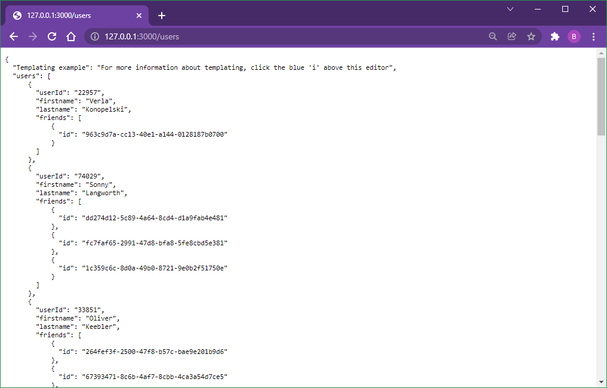

## Mock GitHub API

```dos
curl \
  -H "Accept: application/vnd.github.v3+json" \
  https://api.github.com/users/USERNAME
```

==>

```dos
curl -H "Accept: application/vnd.github.v3+json" https://api.github.com/users/briansu2004
```

==>

```dos
C:\Code\MyMock1\Mockoon\mockoon-simple>curl -H "Accept: application/vnd.github.v3+json" https://api.github.com/users/briansu2004
{
  "login": "briansu2004",
  "id": 6775994,
  "node_id": "MDQ6VXNlcjY3NzU5OTQ=",
  "avatar_url": "https://avatars.githubusercontent.com/u/6775994?v=4",
  "gravatar_id": "",
  "url": "https://api.github.com/users/briansu2004",
  "html_url": "https://github.com/briansu2004",
  "followers_url": "https://api.github.com/users/briansu2004/followers",
  "following_url": "https://api.github.com/users/briansu2004/following{/other_user}",
  "gists_url": "https://api.github.com/users/briansu2004/gists{/gist_id}",
  "starred_url": "https://api.github.com/users/briansu2004/starred{/owner}{/repo}",
  "subscriptions_url": "https://api.github.com/users/briansu2004/subscriptions",
  "organizations_url": "https://api.github.com/users/briansu2004/orgs",
  "repos_url": "https://api.github.com/users/briansu2004/repos",
  "events_url": "https://api.github.com/users/briansu2004/events{/privacy}",
  "received_events_url": "https://api.github.com/users/briansu2004/received_events",
  "type": "User",
  "site_admin": false,
  "name": "Brian Su",
  "company": "Sutek",
  "blog": "https://www.linkedin.com/in/brian-su-opentowork/",
  "location": "Toronto",
  "email": null,
  "hireable": true,
  "bio": "AWS,GCP,Azure;React,node,Golang,Python,FullStack;DevOps,CICDpipeline,Docker;Data,AI;Ontology;IBM,Informatica,Collibra",
  "twitter_username": null,
  "public_repos": 645,
  "public_gists": 5,
  "followers": 0,
  "following": 21,
  "created_at": "2014-02-24T21:34:33Z",
  "updated_at": "2021-12-03T19:44:58Z"
}
```

==>

github_user_full_data.json

=>

mockoon-cli start --data github_user_full_data.json

## Screenshot

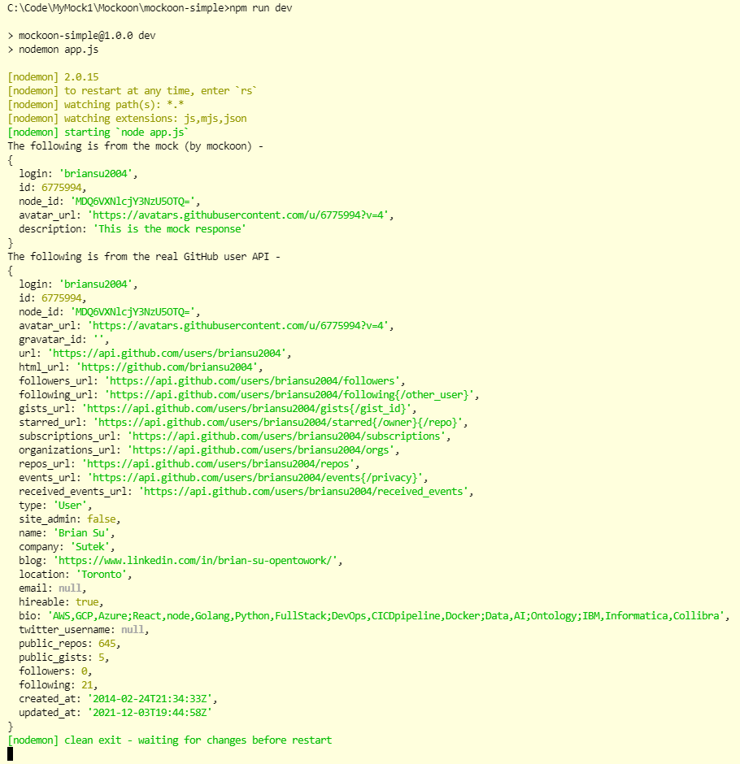

```dos
C:\Code\MyMock1\Mockoon\mockoon-simple>npm run dev

> mockoon-simple@1.0.0 dev
> nodemon app.js

[nodemon] 2.0.15
[nodemon] to restart at any time, enter `rs`
[nodemon] watching path(s): *.*
[nodemon] watching extensions: js,mjs,json
[nodemon] starting `node app.js`
The following is from the mock (by mockoon) -
{
  login: 'briansu2004',
  id: 6775994,
  node_id: 'MDQ6VXNlcjY3NzU5OTQ=',
  avatar_url: 'https://avatars.githubusercontent.com/u/6775994?v=4',
  description: 'This is the mock response'
}
The following is from the real GitHub user API -
{
  login: 'briansu2004',
  id: 6775994,
  node_id: 'MDQ6VXNlcjY3NzU5OTQ=',
  avatar_url: 'https://avatars.githubusercontent.com/u/6775994?v=4',
  gravatar_id: '',
  url: 'https://api.github.com/users/briansu2004',
  html_url: 'https://github.com/briansu2004',
  followers_url: 'https://api.github.com/users/briansu2004/followers',
  following_url: 'https://api.github.com/users/briansu2004/following{/other_user}',
  gists_url: 'https://api.github.com/users/briansu2004/gists{/gist_id}',
  starred_url: 'https://api.github.com/users/briansu2004/starred{/owner}{/repo}',
  subscriptions_url: 'https://api.github.com/users/briansu2004/subscriptions',
  organizations_url: 'https://api.github.com/users/briansu2004/orgs',
  repos_url: 'https://api.github.com/users/briansu2004/repos',
  events_url: 'https://api.github.com/users/briansu2004/events{/privacy}',
  received_events_url: 'https://api.github.com/users/briansu2004/received_events',
  type: 'User',
  site_admin: false,
  name: 'Brian Su',
  company: 'Sutek',
  blog: 'https://www.linkedin.com/in/brian-su-opentowork/',
  location: 'Toronto',
  email: null,
  hireable: true,
  bio: 'AWS,GCP,Azure;React,node,Golang,Python,FullStack;DevOps,CICDpipeline,Docker;Data,AI;Ontology;IBM,Informatica,Collibra',
  twitter_username: null,
  public_repos: 645,
  public_gists: 5,
  followers: 0,
  following: 21,
  created_at: '2014-02-24T21:34:33Z',
  updated_at: '2021-12-03T19:44:58Z'
}
[nodemon] clean exit - waiting for changes before restart
```

## Locate the Mockoon's environment file

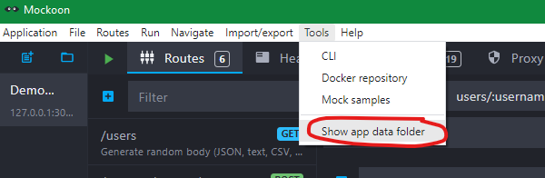

### %APPDATA%\mockoon\storage

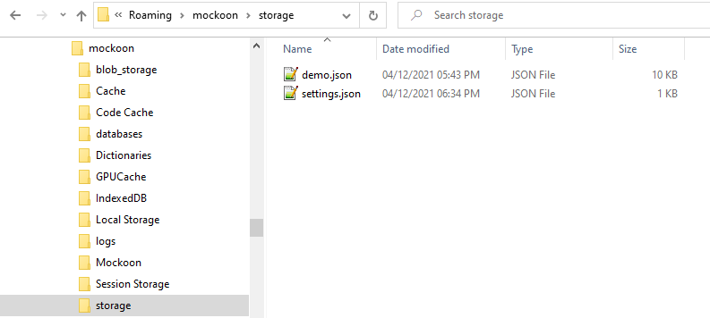

### %APPDATA%\mockoon\storage\setting.json:

The settings of the Mockoon's environment file

### %APPDATA%\mockoon\storage\demo.json

The actual mock definitions.

Including:

```json
  "method": "get",
  "endpoint": "users/:username",
  "responses": [{...}]
```

## Export/Copy the Mockoon's environment file

- Copy demo.json to the project
- Rename to api_full_export.json
- Remove uncessary endpoints

or

- Export as api_export.json
- Remove uncessary endpoints

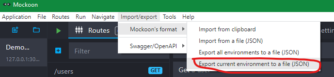

## Mockoon CLI

mockoon-cli start --data api_export.json

```dos
C:\Code\MyMock1\Mockoon\mockoon-simple>mockoon-cli start --data api_export.json
Mock started at http://127.0.0.1:3000 (pid: 0, name: mockoon-demo-api)

C:\Code\MyMock1\Mockoon\mockoon-simple>mockoon-cli list
 Name             Id   Status    Cpu    Memory    Hostname       Port   API prefix
 ──────────────── ──── ───────── ────── ───────── ────────────── ────── ────────────────────────
 mockoon-demo-api 0    online    0      90.6 MB   127.0.0.1      3000

C:\Code\MyMock1\Mockoon\mockoon-simple>mockoon-cli stop
? Please select a process mockoon-demo-api
Process 0:mockoon-demo-api stopped
```

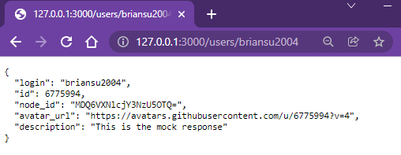

## Mockoon CLI docker !!!

Start docker

```dos
mockoon-cli dockerize --data api_export.json --port 3000 --index 0 --output Dockerfile
docker build -t mockoon-demo-api .
docker run -d -p 3000:3000 mockoon-demo-api
```

### Result

1. Generate Dockerfile template

```dos
mockoon-cli dockerize --data api_export.json --port 3000 --index 0 --output Dockerfile
```

==>

```dos
C:\Code\MyMock1\Mockoon\mockoon-simple>mockoon-cli dockerize --data api_export.json --port 3000 --index 0 --output Dockerfile
Dockerfile was generated and saved to Dockerfile
Run the following commands to build the image and run the container:
    cd
    docker build -t mockoon-demo-api .
    docker run -d -p 3000:3000 mockoon-demo-api
```

2. Modify Dockerfile

The generated Dockerfile needs to be modified a lot!

3. Docker build

```dos
  -t, --tag list                Name and optionally a tag in the
                                'name:tag' format
      --target string           Set the target build stage to build.
```

```dos
docker build -t mock-github-api .
```

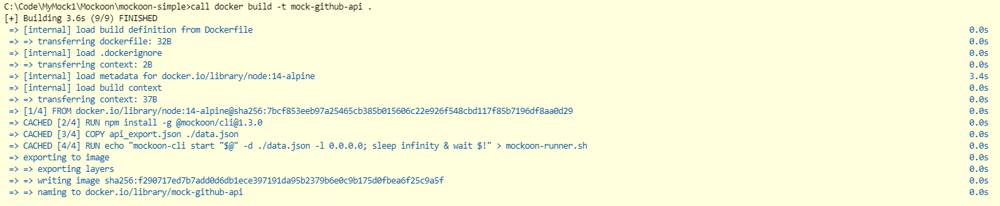

4. Docker run

```dos
docker run -d -p 3000:3000 mock-github-api
```

or

```dos
docker run -it -p 3000:3000 mock-github-api /bin/sh
```

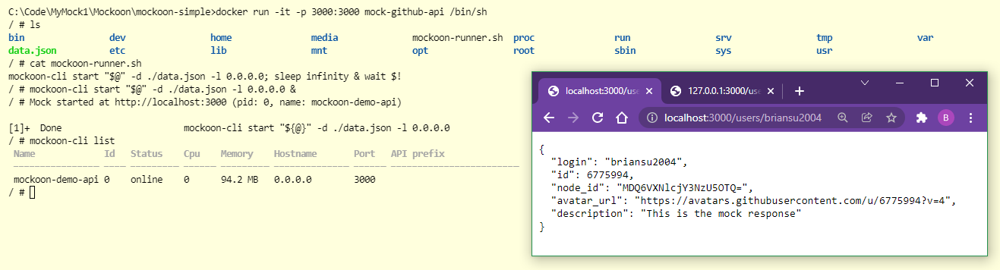

```dos
 -d, --detach    Run container in background and print container ID
```

==>

```dos
C:\Code\MyMock1\Mockoon\mockoon-simple>call docker run -d -p 3000:3000 mock-github-api
471ce15417f9ec97e750e2e272d6e81081436bdc07eb449682f06795d06bf5fd

C:\Code\MyMock1\Mockoon\mockoon-simple>call docker image ls -a
REPOSITORY                           TAG        IMAGE ID       CREATED         SIZE
mock-github-api                      latest     f290717ed7b7   3 minutes ago   204MB
k8s.gcr.io/kube-apiserver            v1.21.5    7b2ac941d4c3   2 months ago    126MB
k8s.gcr.io/kube-controller-manager   v1.21.5    184ef4d127b4   2 months ago    120MB
k8s.gcr.io/kube-proxy                v1.21.5    e08abd2be730   2 months ago    104MB
k8s.gcr.io/kube-scheduler            v1.21.5    8e60ea3644d6   2 months ago    50.8MB
docker/desktop-vpnkit-controller     v2.0       8c2c38aa676e   7 months ago    21MB
docker/desktop-storage-provisioner   v2.0       99f89471f470   7 months ago    41.9MB
k8s.gcr.io/pause                     3.4.1      0f8457a4c2ec   10 months ago   683kB
k8s.gcr.io/coredns/coredns           v1.8.0     296a6d5035e2   13 months ago   42.5MB
k8s.gcr.io/etcd                      3.4.13-0   0369cf4303ff   15 months ago   253MB

C:\Code\MyMock1\Mockoon\mockoon-simple>call docker container ls -a
CONTAINER ID   IMAGE             COMMAND                  CREATED         STATUS         PORTS                    NAMES
471ce15417f9   mock-github-api   "docker-entrypoint.s…"   3 minutes ago   Up 3 minutes   0.0.0.0:3000->3000/tcp   gifted_vaughan

C:\Code\MyMock1\Mockoon\mockoon-simple>docker container stop 471ce15417f9
471ce15417f9

C:\Code\MyMock1\Mockoon\mockoon-simple>docker ps
CONTAINER ID   IMAGE     COMMAND   CREATED   STATUS    PORTS     NAMES
```

```dos
/ $ cat mockoon-runner.sh
mockoon-cli start \"\$@\" -d ./data.json -l 0.0.0.0; sleep infinity & wait \$!
```


## Node import dotenv

```javascript
require("dotenv").config();
```

==>

```javascript
import dotenv from "dotenv";
dotenv.config();
```

## Node Request

```dos
npm i request
```

## Hosts file

C:\Windows\System32\drivers\etc\hosts

notepad C:\Windows\System32\drivers\etc\hosts

## Docker Desktop modifies Hosts file

```dos
# Added by Docker Desktop
10.0.0.113 host.docker.internal
10.0.0.113 gateway.docker.internal
# To allow the same kube context to work on the host and the container:
127.0.0.1 kubernetes.docker.internal
# End of section
```

## 0.0.0.0 vs 127.0.0.1

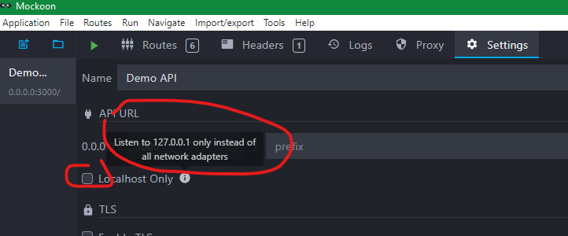

untick the "Localhost only" checkbox -> 0.0.0.0 -> all network adapters

```json
"hostname": "0.0.0.0",
```

tick the "Localhost only" checkbox -> 127.0.0.1 -> Localhost only

```json
"hostname": "127.0.0.1",
```

Recommend: untick the "Localhost only" checkbox

## Docker image vs container

- Build image first
- Possible multiple containers for 1 image
- Better to stop and remove/prune container before rebuilding image

## docker container prune -f

```dos
C:\Code\MyMock1\Mockoon\mockoon-simple>docker container prune -f
Deleted Containers:
53936779ba2bd08d6b073b088e8cefed062be599a746fe2f37c7c8f534f026cb
e3345e2d5ec495a8d14a3b6c5de87f3aa0c5a96cb6b31e893485dfc40464fdd6
d3ff835253d422f88d396ba5796ac0545646a725da8cbfe98f2642d6b79d2962
ac778cb10d9f9dd413cf1d3150c4ad577258cd41a6c1c3b0734d6bc67e6b9ebe

Total reclaimed space: 7.326kB
```

## Docker Desktop for Windows

Docker Desktop for Windows uses microsoft-standard-WSL2.

```dos
# uname -a
Linux 7c1d45ee28fa 5.4.72-microsoft-standard-WSL2 #1 SMP Wed Oct 28 23:40:43 UTC 2020 x86_64 Linux
```

There is no apt or apt-get!

There are npm and yarn in node:14-alpine image.

Sorry, is it Windows 10 WSL2 problem? Or the base image node's problem?

## Docker do NOT use root

Can use "node" for node image.

## Docker Desktop nice tool

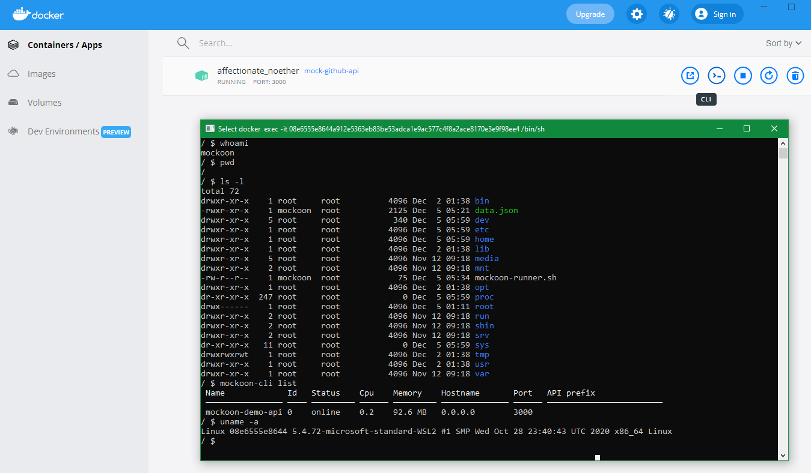

## Busybox

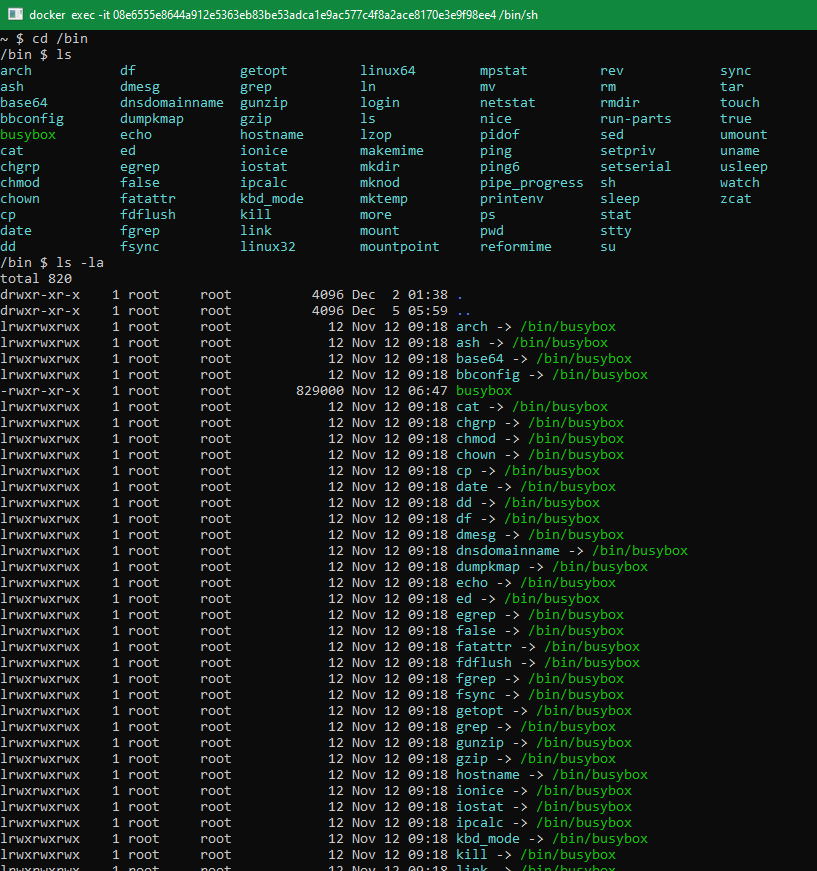

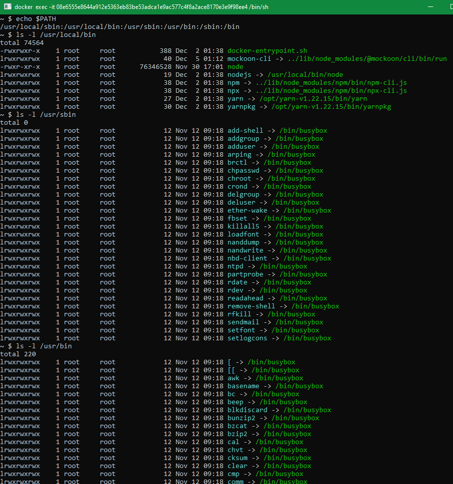

## Docker Container Stop

Use command "Docker Container Stop" to stop a docker container is much faster than using Docker Desktop app.

## Cool, easy and useful way to insert screeshot in README.md

Ctrl + V in README.md -> automatically create the screenshot PNG file in images/README folder!
